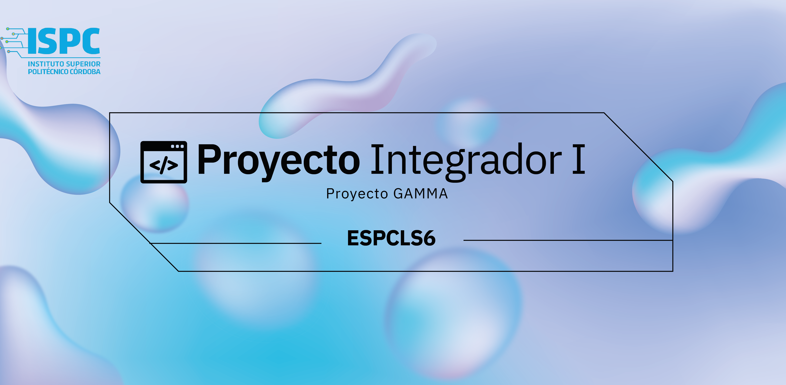

# PROYECTO INTEGRADOR I
Nuestro grupo es **ESPCLS6** y somos estudiantes de primer año de la Tecnicatura Superior en Ciencias de Datos e Inteligencia Artificial del Instituto Superior Politécnico Córdoba.

+ Cecilia Espada
+ Luis Siccardi
+ Laura Peralta
+ Marilena Castilla
+ Gabriela López
+ Martín Solá

# PROYECTO
Este trabajo surge como propuesta del espacio curricular de *Proyecto Integrador I* a cargo de los profesores Silvia Perotti y Héctor Prado.

En esta oportunidad tenemos que desarrollar el “Proyecto Gamma” en el cual realizamos un Web Scraping para posteriormente guardar los datos obtenidos en una base de datos.

*¿Qué es el Web Scraping?* Es el proceso de extracción de datos almacenados en la web, cuyo objetivo es recopilar la información en un servidor y tiene múltiples aplicaciones como por ejemplo obtener información sobre un producto y sus reseñas en un eCommerce o  de las noticias de un diario digital para posteriormente realizar un análisis.
En esta ocasión nuestro proyecto se basa en la información obtenida en la página web de la Prefectura Naval Argentina, de la cual obtendremos la información sobre los niveles de los ríos. 

Se utilizo la web de la prefectura naval  en el siguiente link https://contenidosweb.prefecturanaval.gob.ar/alturas/

Se hace Scraping de niveles de los ríos  

# LIBRERÍAS UTILIZADAS

## Requests

Requests es una librería de Python que facilita realizar las peticiones con protocolo HTTP. En el Web Scraping la utilizamos para hacer la petición GET al sitio web a scrapear.  

## Beautiful Soup

Beautiful Soup es una librería de Python para extraer datos de archivos HTML y XML. Funciona con su analizador favorito para proporcionar formas idiomáticas de navegar, buscar y modificar el esquema de análisis. La utilizamos en este proyecto para extraer los datos de la web y la combinamos con el “HTML parser” LXML.

## Módulo LXML

LXML es un módulo de Python que se encarga de  procesar documentos XML y HTML y convertirlos en datos. Este módulo lo utilizamos para el Web Scraping al momento de extraer el contenido HTML de una web. LXML es conocido como un “HTML parser”

## Pandas

Pandas es una librería de Python especializada en el manejo y análisis de estructuras de datos. Permite leer y escribir fácilmente Dataframes, ficheros en formato CSV, Excel y bases de datos SQL. Crea estructuras de datos en formato array. Además posee métodos para reordenar, dividir y combinar conjuntos de datos. En nuestro caso, usamos Pandas para la creación y el manejo de Dataframes y archivos .csv, como así también para la visualización de esos datos. 

# DESARROLLO
Para la organización de nuestro equipo de trabajo utilizamos la herramienta Trello, en la cual nos dividimos las tareas a realizar. 
Para la realización del mismo utilizamos Python con las librerías Beautiful Soup, Requests  y Pandas.
Luego la información obtenida la almacenamos en una base de datos utilizando MySQL.
